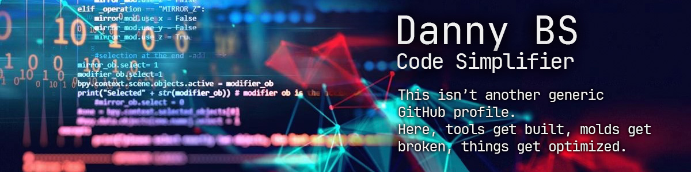

<div align="right">
  <a href="https://coff.ee/danybranding"></a>
  <a href="mailto:hola@daniel-benitez.com"></a>
  <a href="https://twitter.com/danybranding"></a>
</div>

## 👨🏽‍💻 Profile JSON
```json
{
  "name": "Danny BS",
  "location": "Mexico City",
  "skills": [
    "CSS Architecture & SCSS Workflows",
    "Custom Framework Development",
    "JavaScript Vanilla & Shortcut Utilities",
    "WordPress Theme & Plugin Development",
    "Custom PHP Backends & Automation",
    "Performance Tuning & Audits",
    "Zero Dependency Patterns",
    "Build Automation (Webpack, Rollup)"
  ],
  "interests": [
    "Performance",
    "DX",
    "No-Bullshit Code",
    "Building Tools from Scratch",
    "Empowering Local Brands"
  ]
}
`````
## 🖥️ Tech Stack

### 🚀 Languages


### 📚 Libraries & DB


### 🛠️ Tools & Build


### 💻 Programs


## 🔧 What you’ll find here

- Frameworks designed to last — not to look pretty on slides.
- Utilities that respect your time and brain.
- Shortcuts that don’t break under pressure.
- Experiments that survive or die trying.

## 🚫 What you won’t find here

- Copy-paste solutions without soul.
- Useless dependencies.
- Bloated templates.
- Influencer noise or hype.

## ⚙️ Philosophy

> *Build better. Share better. Break what’s useless.*  
> *If it exists, improve it. If it doesn’t, create it.*  
> *Here there’s no fluff — only code that does its job.*
